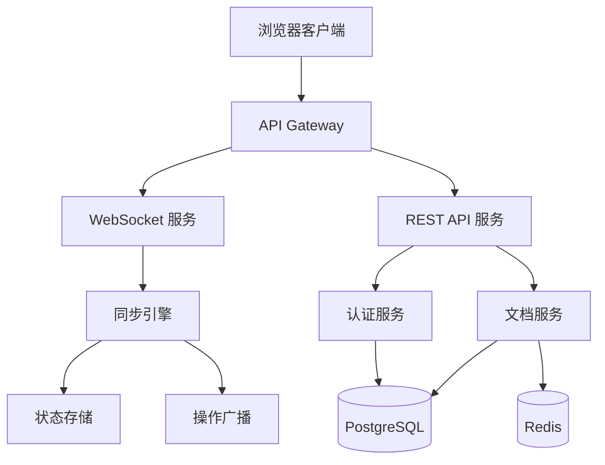
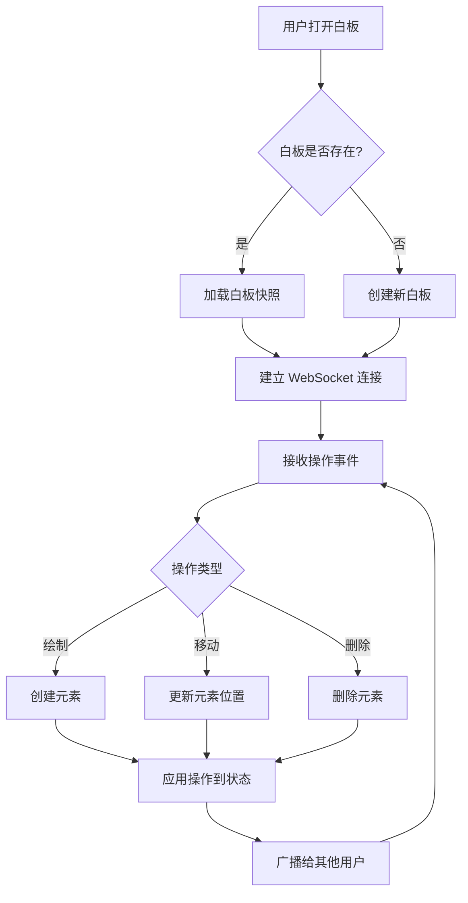
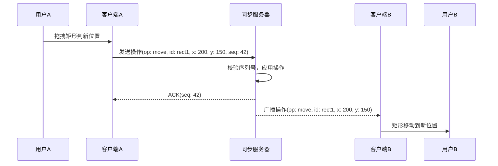
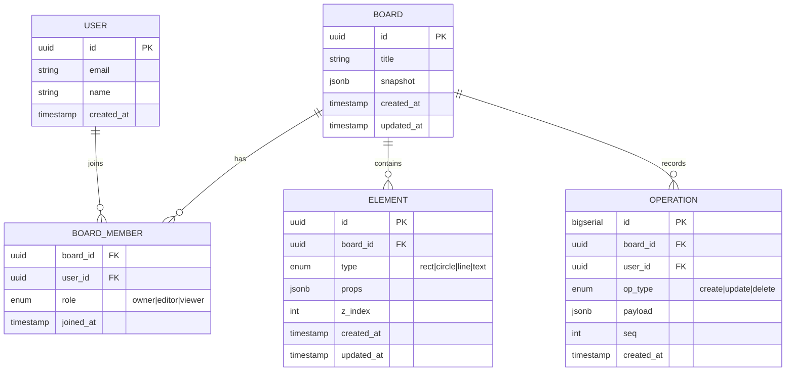

以下是一个由 tech-solution-writer 生成的技术方案示例，供参考：

> **章节标注说明**：简介、架构与流程、技术选型、关键代码示例为必要章节；数据模型、API 接口设计为可选章节，本示例因涉及数据持久化和前后端交互，故两个可选章节均纳入。

---

假设用户输入："我想做一个在线协作白板工具，支持多人实时编辑，可以画图形、写文字、拖拽移动"

生成的技术方案如下：

---

# 在线协作白板 技术方案

## 1. 简介

### 项目背景与目标

构建一个基于 Web 的在线协作白板工具，支持多人实时编辑。用户可以在白板上绘制图形、输入文字、拖拽移动元素，所有操作实时同步到所有在线协作者。

### 核心功能概述

- 画布操作：绘制矩形/圆形/线条、输入文字、拖拽移动/缩放元素
- 实时协作：多人同时编辑，操作实时同步，显示其他用户光标位置
- 白板管理：创建/删除白板、分享白板链接、权限控制

### 方案适用范围

本方案面向 MVP 阶段，支持 50 人以内同时在线协作，单白板元素上限 5000 个。

## 2. 整体架构与流程

### 系统架构图



### 核心业务流程图



### 关键交互时序图



## 3. 技术选型

### 技术栈总览

| 层级 | 技术选择 | 版本 |
|------|---------|------|
| 前端 | React + Canvas (Konva.js) | React 18, Konva 9 |
| 实时通信 | WebSocket (Socket.IO) | Socket.IO 4 |
| 后端 | Node.js (Fastify) | Node 20, Fastify 4 |
| 数据库 | PostgreSQL | 16 |
| 缓存 | Redis | 7 |
| 部署 | Docker + K8s | - |

### 关键选型对比与理由

**前端渲染方案：Canvas (Konva.js) vs SVG vs DOM**

| 维度 | Canvas (Konva.js) | SVG | DOM |
|------|-------------------|-----|-----|
| 大量元素性能 | ✅ 优秀（5000+ 元素流畅） | ❌ DOM 节点多时卡顿 | ❌ 同 SVG |
| 交互事件支持 | ✅ Konva 封装了事件系统 | ✅ 原生 DOM 事件 | ✅ 原生 DOM 事件 |
| 文本编辑 | ⚠️ 需要额外处理 | ✅ 原生支持 | ✅ 原生支持 |
| 学习成本 | 中等 | 低 | 低 |

**选择 Konva.js**：白板场景元素数量可能达到数千个，Canvas 渲染性能优势明显；Konva 提供了完善的事件和拖拽支持，弥补了 Canvas 交互的短板。

**实时同步方案：OT vs CRDT**

选择 **OT（Operational Transformation）**：白板操作具有明确的顺序性（先创建再移动），OT 更直观且实现复杂度可控。CRDT 适合无中心服务器的 P2P 场景，本方案有中心化同步服务器，OT 更合适。

## 4. 数据模型

### ER 图



### 核心表结构定义

**element.props 字段结构**（JSONB，按类型不同）：

```typescript
// 矩形元素
{ width: number, height: number, x: number, y: number, fill: string, stroke: string, strokeWidth: number }

// 文本元素
{ text: string, x: number, y: number, fontSize: number, fontFamily: string, fill: string }

// 线条元素
{ points: number[], stroke: string, strokeWidth: number }
```

### 索引与查询优化策略

- `element` 表：`(board_id, z_index)` 联合索引，支持按白板加载元素并按层级排序
- `operation` 表：`(board_id, seq)` 联合索引，支持按序列号快速定位操作历史
- `board.snapshot` 使用 JSONB 类型，支持局部更新避免全量替换

## 5. API 接口设计

### 接口总览

| 方法 | 路径 | 说明 |
|------|------|------|
| POST | /api/boards | 创建白板 |
| GET | /api/boards/:id | 获取白板信息 |
| GET | /api/boards/:id/elements | 获取白板所有元素 |
| POST | /api/boards/:id/members | 邀请协作者 |
| WS | /boards/:id | 白板实时协作通道 |

### 核心接口定义

**创建白板**

```
POST /api/boards
Request:  { title: string }
Response: { id: string, title: string, createdAt: string }
```

**获取白板元素**

```
GET /api/boards/:id/elements
Response: {
  elements: Array<{
    id: string, type: "rect"|"circle"|"line"|"text",
    props: object, zIndex: number
  }>
}
```

### 认证鉴权方案

- 使用 JWT Token 鉴权
- REST API：Bearer Token 放在 Authorization Header
- WebSocket：连接时通过 query 参数传递 token，服务端验证后建立连接

## 6. 关键代码示例

### OT 操作变换核心逻辑

这段代码是同步引擎的核心，处理多人并发操作时的冲突解决：

```typescript
// server/src/sync/ot.ts
// OT 变换函数：将操作 op2 针对 op1 进行变换，返回变换后的 op2'

function transform(op1: Operation, op2: Operation): Operation {
  // 同一元素的操作需要变换
  if (op1.elementId === op2.elementId) {
    // 两个移动操作：位置需要累加偏移量
    if (op1.type === 'move' && op2.type === 'move') {
      return {
        ...op2,
        payload: {
          x: op2.payload.x + (op1.payload.x - op1.payload.prevX),
          y: op2.payload.y + (op1.payload.y - op1.payload.prevY),
        }
      };
    }
    // 先删后改：后续操作变为 no-op
    if (op1.type === 'delete' && op2.type !== 'delete') {
      return { ...op2, type: 'noop' };
    }
  }
  // 不同元素的操作互不影响，直接返回
  return op2;
}
```

### WebSocket 消息处理

```typescript
// server/src/sync/handler.ts
// 处理客户端发来的操作事件

socket.on('operation', async (op: ClientOperation) => {
  const boardId = socket.data.boardId;
  const userId = socket.data.userId;

  // 1. 分配递增序列号，保证操作全局有序
  const seq = await redis.incr(`board:${boardId}:seq`);

  // 2. 与待确认队列中的操作进行 OT 变换
  const pendingOps = await getPendingOps(boardId);
  let transformedOp = op;
  for (const pending of pendingOps) {
    transformedOp = transform(pending, transformedOp);
  }

  // 3. 应用变换后的操作到状态
  await applyOperation(boardId, transformedOp);

  // 4. 广播给同白板的其他用户
  socket.to(`board:${boardId}`).emit('remote-operation', {
    ...transformedOp,
    seq,
    userId,
  });

  // 5. 确认给发送者
  socket.emit('ack', { seq });
});
```

### 前端 Konva 画布渲染

```typescript
// client/src/canvas/Board.tsx
// 将服务端元素数据渲染到 Konva 画布

function Board({ elements }: { elements: ServerElement[] }) {
  const stageRef = useRef<Konva.Stage>(null);

  return (
    <Stage ref={stageRef} width={window.innerWidth} height={window.innerHeight}>
      <Layer>
        {elements.map(el => {
          switch (el.type) {
            case 'rect':
              return <Rect key={el.id} id={el.id} {...el.props} draggable />;
            case 'circle':
              return <Circle key={el.id} id={el.id} {...el.props} draggable />;
            case 'text':
              return <Text key={el.id} id={el.id} {...el.props} draggable />;
            case 'line':
              return <Line key={el.id} id={el.id} {...el.props} />;
          }
        })}
      </Layer>
    </Stage>
  );
}
```

